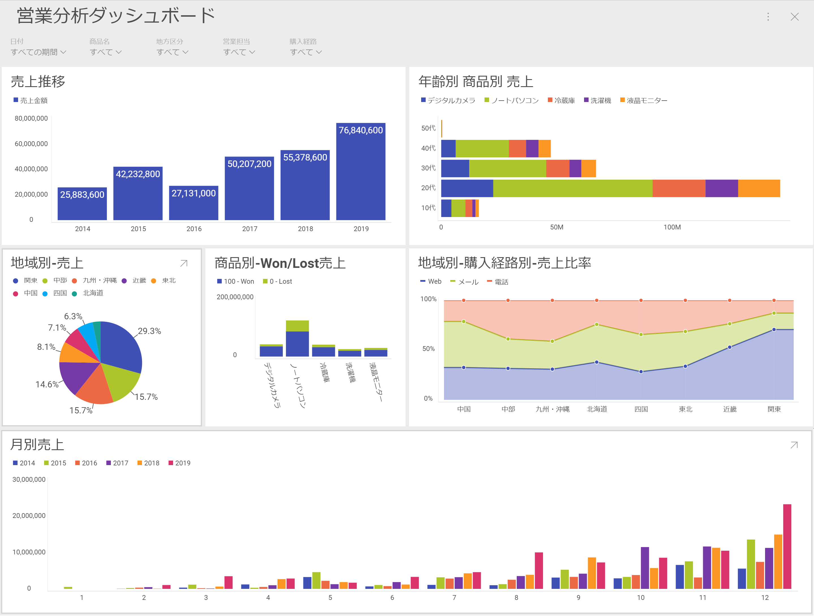
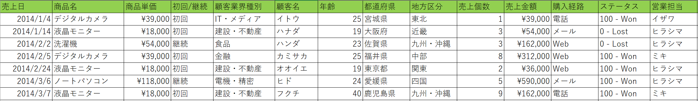

# Reveal ダッシュボード作成ハンズオン

## このハンズオンについて

このハンズオンでは、[Reveal](https://www.revealbi.io/jp) を使って簡単な売り上げデータを視覚化・分析します。

ダッシュボードのイメージ

## データソース

[dataフォルダ](data/) に格納されているExcelファイルをデータソースとして利用します。以下のようなサンプルの売り上げデータが格納されています。サンプルデータは2014年から5年間の売り上げ情報（案件情報）で、商品・顧客情報・販売地域・購買経路・案件ステータスなどの情報を含んでいます。

## ハンズオンのお題

上記の売り上げデータを元に、営業チーム/企画チーム/マーケティングチームのステークホルダーが集まり、次年度の計画や売り上げを上げるための施策を検討する予定です。検討にあたり、様々な軸・角度から売り上げを分析できるようなダッシュボードを [Reveal](https://app.revealbi.io/) で作成しましょう。

- 売り上げの推移を確認して、次年度の計画を行いたいい
- 地域別の売り上げを確認して、人員配置を見直したい
- 商品別の成約率/失注(キャンセル)率を確認して、問題のある商品を改善したい
- 地域ごとの購買経路を確認して、広告や販促アプローチを見直したい
- 毎年の月ごとの売り上げトレンドを確認して、キャンペーン時期を決めたい
- その他、できるだけ多くの様々な切り口からデータを掘り下げたい

※冒頭のダッシュボードイメージはあくまで１例です。自由にダッシュボードを作ってみましょう。

## リファレンス

- [基本的なダッシュボードの作り方(英語)](https://www.revealbi.io/help/creating-dashboards)
- [ダッシュボードフィルター(英語)](https://www.revealbi.io/help/dashboard-filters)
- [計算フィールド(英語)](https://www.revealbi.io/help/calculated-fields)

